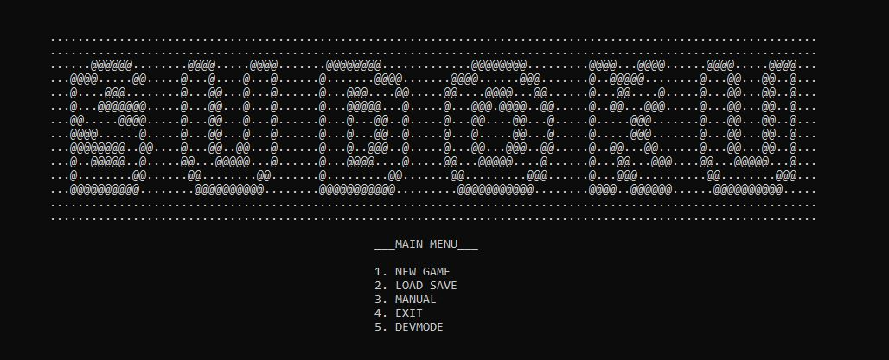
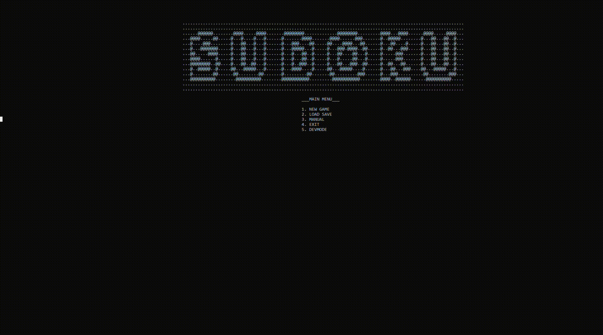
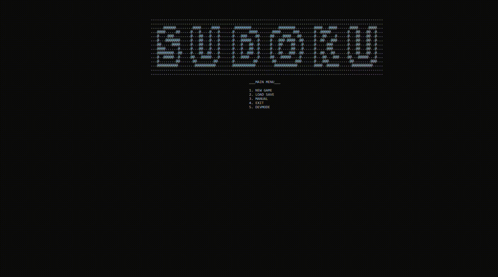

# ConsoleSudoku

**Sudoku console game in C**

------

## MANUAL

Input number in format:  
`ROW COL NUMBER`  
Delete number in format:  
`ROW COL -1`

### SPECIAL COMMANDS:
- `0 0 0` – SAVE  
- `0 0 1` – HELP  
- `0 0 9` – EXIT

You can turn on dev mode in main menu - shows allocs and disallocs of the board 
**The player is rewarded for winning :]**

------

## NEW GAME

- Choose *board size*: `4x4`, `9x9`, `16x16`  
- In `16x16` board game uses hexadecimal system  
  **(16 = G, not 10 for better readibility)**  
  Input numbers in decimal format. Example - 10 instead of A

- Choose *difficulty*:  
  `Novice`, `Apprentice`, `Master`  
  The higher difficulty, the less numbers shown on the starting board

- Set *seed*:  
  `0` = random seed  
  Other than 0 = seeded session

-----

### NEW GAME GAMEPLAY (WITH DEBUG MODE ON)

Game shows allocation of memory, number of moves and plays sound on successful input

-----

### LOADING SAVE

You can save and later load your session. Even after closing console.
Stats before save and after loading are summed on win.

---

## Bugs and things to fix

- If player gives inputs (`R` `Enter` `C` `Enter` `N`), instead of one line, they can loose track of what was already input:
  ➤ **Add tracker of inputs**

- Player can save only one session at a time:
  ➤ **Make multi save system**

- Folder structure xDD

- All other bugs I don't know about :]

---

## Majóweczka

**Me af:**  

